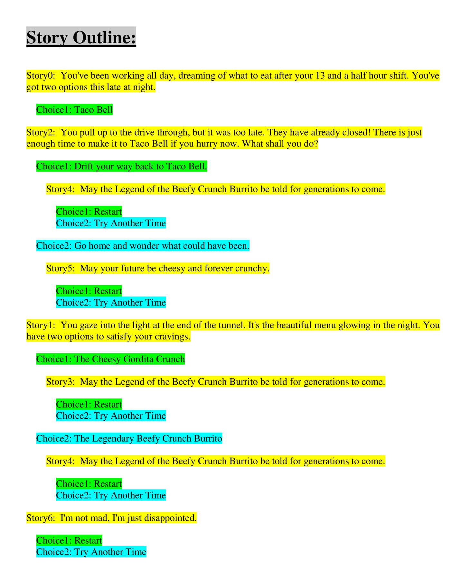

<h1 align="center">Voyage - iOS App</h1>

**Voyage** is an engaging "choose your own adventure" game where you get to decide the direction of a story! Similar to the popular "Life Line" app, your choices will influence the outcome, providing a unique and interactive storytelling experience. Make your choices wisely and see how your decisions shape the adventure!

## Features :

- **Interactive Storytelling**: Choose your path in a branching narrative that unfolds based on your decisions.
- **Engaging UI**: A clean and intuitive design that immerses you in the story.
- **Multiple Endings**: The story can end in various ways, depending on the choices you make throughout the game.
- **Story Progression**: Keep track of your story and continue your adventure with each playthrough.

## Installation :

To run this project locally:

1. Clone the repository:
    ```bash
    git clone https://github.com/deepanshubajaj/Voyage-iOSApp.git
    ```

2. Open the project in Xcode:
    ```bash
    open Voyage.xcodeproj
    ```

3. Build and run the app on a simulator or physical device.

> Make sure you have Xcode installed and configured properly to run the project.

## Story Outline :

<p align="center">
  
</p>
<p align="center">
  *Snapshot for Story line.*
</p>

<p align="center">
  <a href="ProjectOutputs/Document/storyOutline.pdf" download>Download PDF</a>
</p>
<p align="center">
  *Pdf for Story Line.*
</p>

## App Look :

<p align="center">
  
</p>
<p align="center">
  *App snapshot in the simulator.*
</p>

## Screenshots :

<p align="center">
  
</p>
<p align="center">
  *Splash screen displayed upon app launch.*
</p>

<p align="center">
  <div style="display: flex; justify-content: center; gap: 10px;">
    
    
    
  </div>
</p>

<p align="center">
  <div style="display: flex; justify-content: center; gap: 10px;">
    
    
    
  </div>
</p>

<p align="center">
  *Screenshots of the Voyage app showing different stages of the interactive story.*
</p>

## App Icon :

<p align="center">
  
</p>
<p align="center">
  *The app icon reflects the adventurous theme of the Voyage app.*
</p>

## Video Demo :

Here’s a short video showcasing the app's functionality:

<p align="center">
  
</p>

[Watch Working Video](ProjectOutputs/WorkingVideo/workingVideo.MP4)
